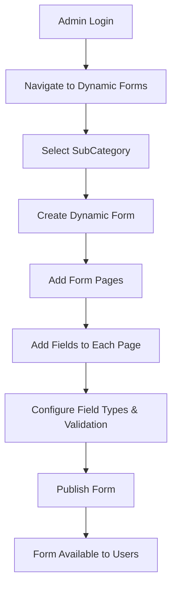
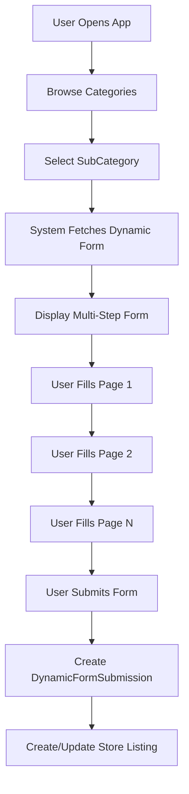

# Dynamic Forms System Documentation

## 📋 Overview

The Dynamic Forms System is a powerful, flexible form builder that allows the Renturo platform to support **any rental category** by enabling admins to create custom forms for each subcategory. This system is the core of the platform's flexibility, allowing users to create listings or make bookings through dynamically generated forms.

---

## 🏗️ Architecture Overview

The Dynamic Forms system follows a **4-tier hierarchical structure**:

```
Dynamic Form (Template)
    └── Dynamic Form Pages (Sections/Steps)
            └── Dynamic Form Fields (Input Elements)
                    └── Dynamic Form Submissions (User Data)
```

---

## 1️⃣ Dynamic Forms

**Database Table**: `dynamic_forms`  
**Model**: `App\Models\DynamicForm`

### Purpose
The main form template/definition that serves as a blueprint for collecting specific information for a subcategory.

### Schema

```php
- id (PK)                    // Primary key
- name (string)              // Form name (e.g., "Basketball Arena Rental Form")
- description (text)         // Detailed description of the form
- subcategory_id (FK)        // Foreign key to sub_categories table
- created_at (timestamp)     // Creation timestamp
- updated_at (timestamp)     // Last update timestamp
- deleted_at (timestamp)     // Soft delete timestamp

// Constraints
UNIQUE (name, subcategory_id) // One form per name per subcategory
```

### Relationships

```php
// Eloquent Relationships
belongsTo(SubCategory::class)              // Each form belongs to one subcategory
hasMany(DynamicFormPage::class)            // A form has multiple pages
hasMany(DynamicFormSubmission::class)      // A form has multiple submissions
```

### Fillable Attributes

```php
protected $fillable = [
    'name', 
    'description', 
    'subcategory_id'
];
```

### Example Use Cases

| SubCategory | Dynamic Form Name |
|------------|-------------------|
| Basketball Court | Basketball Arena Rental Form |
| Apartment | Residential Lease Application |
| Wedding Venue | Wedding Venue Booking Form |
| Car | Vehicle Rental Agreement |
| Photographer | Photography Service Request |

---

## 2️⃣ Dynamic Form Pages

**Database Table**: `dynamic_form_pages`  
**Model**: `App\Models\DynamicFormPage`

### Purpose
Represents multi-step form sections, enabling wizard/stepper UI for better user experience. Each page is a step in the form submission process.

### Schema

```php
- id (PK)                    // Primary key
- dynamic_form_id (FK)       // Links to dynamic_forms table
- user_id (FK)               // Creator of the page
- title (string)             // Page title (e.g., "Personal Information")
- sort_no (unsigned int)     // Page order/sequence (0, 1, 2, ...)
- created_at (timestamp)     // Creation timestamp
- updated_at (timestamp)     // Last update timestamp
- deleted_at (timestamp)     // Soft delete timestamp
```

### Relationships

```php
// Eloquent Relationships
belongsTo(DynamicForm::class)          // Each page belongs to one form
belongsTo(User::class)                 // Created by a user
hasMany(DynamicFormField::class)       // A page has multiple fields
belongsTo(SubCategory::class)          // Legacy relationship (deprecated)

// Eager Loading
protected $with = ['dynamicFormFields']; // Auto-loads fields
```

### Fillable Attributes

```php
protected $fillable = [
    'user_id',
    'title',
    'sort_no',
    'dynamic_form_id',
];
```

### Example Structure

```
Basketball Arena Rental Form
  ├── Page 1: "Basic Information" (sort_no: 0)
  ├── Page 2: "Booking Details" (sort_no: 1)
  └── Page 3: "Payment Information" (sort_no: 2)
```

---

## 3️⃣ Dynamic Form Fields

**Database Table**: `dynamic_form_fields`  
**Model**: `App\Models\DynamicFormField`

### Purpose
Individual input fields within a page. Each field represents a specific piece of data to be collected from the user.

### Schema

```php
- id (PK)                       // Primary key
- dynamic_form_page_id (FK)     // Links to dynamic_form_pages table
- user_id (FK)                  // Creator of the field
- input_field_label (string)    // Display label (e.g., "Full Name")
- input_field_name (string)     // Field name/key (e.g., "full_name")
- input_field_type (enum)       // Field type (see FIELD_TYPES below)
- is_required (boolean)         // Validation flag
- sort_no (unsigned int)        // Field order within the page
- data (json)                   // Additional field configuration
- created_at (timestamp)        // Creation timestamp
- updated_at (timestamp)        // Last update timestamp
- deleted_at (timestamp)        // Soft delete timestamp
```

### Supported Field Types

```php
const FIELD_TYPES = [
    'heading',      // Display heading (non-input)
    'body',         // Display text/paragraph (non-input)
    'text',         // Single line text input
    'textarea',     // Multi-line text input
    'number',       // Numeric input
    'email',        // Email input with validation
    'date',         // Date picker
    'time',         // Time picker
    'select',       // Dropdown/select box
    'checkbox',     // Single checkbox
    'radio',        // Radio button group
    'checklist',    // Multiple checkboxes
    'attachment',   // File attachment
    'rating',       // Star rating input
    'password',     // Password input (masked)
    'multiselect',  // Multi-select dropdown
    'file',         // File upload
    'hidden',       // Hidden field
    'color',        // Color picker
    'url',          // URL input with validation
];
```

### Relationships

```php
// Eloquent Relationships
belongsTo(DynamicFormPage::class)      // Each field belongs to one page
belongsTo(User::class)                 // Created by a user
```

### Fillable Attributes

```php
protected $fillable = [
    'user_id',
    'dynamic_form_page_id',
    'input_field_label',
    'input_field_name',
    'input_field_type',
    'is_required',
    'sort_no',
    'data',
    'value'
];
```

### Data JSON Structure

The `data` field stores additional configuration as JSON:

```json
{
    "min": "08:00",
    "max": "22:00",
    "options": ["Option 1", "Option 2", "Option 3"],
    "placeholder": "Enter your answer here",
    "validation": {
        "minLength": 5,
        "maxLength": 100
    }
}
```

### Example Fields

```json
Page: "Basic Information"
  ├── Field 1: {
        "label": "Full Name",
        "name": "full_name",
        "type": "text",
        "is_required": true,
        "sort_no": 0
      }
  ├── Field 2: {
        "label": "Email Address",
        "name": "email",
        "type": "email",
        "is_required": true,
        "sort_no": 1
      }
  └── Field 3: {
        "label": "Preferred Time",
        "name": "preferred_time",
        "type": "time",
        "is_required": false,
        "sort_no": 2,
        "data": {"min": "08:00", "max": "22:00"}
      }
```

---

## 4️⃣ Dynamic Form Submissions

**Database Table**: `dynamic_form_submissions`  
**Model**: `App\Models\DynamicFormSubmission`

### Purpose
Stores user-submitted form data (actual bookings, applications, or listings). This is where the actual user input is persisted.

### Schema

```php
- id (PK)                    // Primary key
- dynamic_form_id (FK)       // Which form template was used
- user_id (FK, nullable)     // Who submitted (null if guest)
- store_id (FK, nullable)    // Related store/listing
- name (string, nullable)    // Submission name/title
- about (text, nullable)     // Submission description
- data (json)                // The actual form field values
- created_at (timestamp)     // Submission timestamp
- updated_at (timestamp)     // Last update timestamp
- deleted_at (timestamp)     // Soft delete timestamp
```

### Relationships

```php
// Eloquent Relationships
belongsTo(DynamicForm::class)                  // Links to form template
belongsTo(Store::class)                        // Links to the listing/property
hasMany(DynamicFormAvailability::class)        // Booking availability slots
```

### Fillable Attributes

```php
protected $fillable = [
    'dynamic_form_id',
    'user_id',
    'store_id',
    'data',
    'name',
    'about'
];
```

### Data JSON Structure

The `data` field contains the complete form submission:

```json
{
  "store_id": 123,
  "dynamic_form_id": 45,
  "dynamic_form_pages": [
    {
      "dynamic_form_page_id": 1,
      "title": "Basic Information",
      "sort_no": 0,
      "dynamic_form_fields": [
        {
          "field_id": 1,
          "input_field_label": "Full Name",
          "input_field_name": "full_name",
          "input_field_type": "text",
          "is_required": 1,
          "sort_no": 0,
          "data": null,
          "value": "John Doe"
        },
        {
          "field_id": 2,
          "input_field_label": "Email",
          "input_field_name": "email",
          "input_field_type": "email",
          "is_required": 1,
          "sort_no": 1,
          "data": null,
          "value": "john@example.com"
        },
        {
          "field_id": 3,
          "input_field_label": "Preferred Time",
          "input_field_name": "preferred_time",
          "input_field_type": "time",
          "is_required": 0,
          "sort_no": 2,
          "data": {"min": "08:00", "max": "22:00"},
          "value": "14:00"
        }
      ]
    },
    {
      "dynamic_form_page_id": 2,
      "title": "Booking Details",
      "sort_no": 1,
      "dynamic_form_fields": [
        {
          "field_id": 4,
          "input_field_label": "Event Date",
          "input_field_name": "event_date",
          "input_field_type": "date",
          "is_required": 1,
          "sort_no": 0,
          "data": null,
          "value": "2024-10-20"
        }
      ]
    }
  ]
}
```

---

## 🔄 Workflow & Use Cases

### Admin/Owner Workflow (Web - React/Inertia.js)



**Steps**:
1. **Admin creates a Dynamic Form** for a specific subcategory
   - Example: "Basketball Court Booking Form" for subcategory "Basketball Court"
2. **Admin creates Form Pages** (steps in the wizard)
   - Page 1: "Personal Details"
   - Page 2: "Booking Schedule"
   - Page 3: "Payment Info"
3. **Admin adds Form Fields** to each page
   - Text inputs, dropdowns, date pickers, file uploads, etc.
4. **Admin configures field properties**
   - Labels, validation rules, required flags, sort order
5. **Admin publishes the form** - Now available for users

### Client/User Workflow (Flutter Mobile App)



**Steps**:
1. **User selects a category/subcategory**
   - Example: "Sports Venues" → "Basketball Court"
2. **System fetches the Dynamic Form** for that subcategory
   - Retrieves form pages and fields
3. **User fills out the form** using `DynamicFormWidget` (multi-step wizard)
   - Stepper UI with page navigation
   - Field validation on each page
4. **User submits the form**
   - Creates a `DynamicFormSubmission` record
   - All field values stored in JSON format
5. **System processes the booking**
   - Creates/updates store listing
   - Handles availability, pricing, etc.

---

## 🔗 Relationship with Categories & SubCategories

```
Category (e.g., "Sports Venues")
  └── SubCategory (e.g., "Basketball Court")
        └── Dynamic Form (e.g., "Basketball Arena Rental Form")
              ├── Form Pages
              │     ├── Page 1: "Basic Info" (sort_no: 0)
              │     │     └── Form Fields
              │     │           ├── Field 1: "Name" (text, required)
              │     │           ├── Field 2: "Email" (email, required)
              │     │           └── Field 3: "Phone" (text, required)
              │     ├── Page 2: "Booking Details" (sort_no: 1)
              │     │     └── Form Fields
              │     │           ├── Field 4: "Date" (date, required)
              │     │           ├── Field 5: "Start Time" (time, required)
              │     │           └── Field 6: "End Time" (time, required)
              │     └── Page 3: "Additional Services" (sort_no: 2)
              │           └── Form Fields
              │                 ├── Field 7: "Equipment Needed" (checkbox)
              │                 └── Field 8: "Special Requests" (textarea)
              └── Form Submissions
                    ├── Submission 1 (User A, Store 123)
                    ├── Submission 2 (User B, Store 456)
                    └── Submission 3 (User C, Store 789)
```

### Key Constraint

- Each **SubCategory** can have **multiple Dynamic Forms** with unique names
- Enforced by: `UNIQUE(name, subcategory_id)` constraint
- This ensures form names are unique within a subcategory

---

## 💡 Real-World Examples

### Example 1: Basketball Court Rental

```
Category: Sports Venues
SubCategory: Basketball Court
Dynamic Form: "Basketball Arena Booking"

┌─────────────────────────────────────────┐
│ Page 1: "Event Details"                 │
├─────────────────────────────────────────┤
│ • Event Name (text, required)           │
│ • Event Date (date, required)           │
│ • Start Time (time, required)           │
│ • End Time (time, required)             │
└─────────────────────────────────────────┘

┌─────────────────────────────────────────┐
│ Page 2: "Participants"                  │
├─────────────────────────────────────────┤
│ • Number of Players (number, required)  │
│ • Team Names (textarea)                 │
│ • Age Group (select, required)          │
│   Options: [Youth, Adult, Senior]       │
└─────────────────────────────────────────┘

┌─────────────────────────────────────────┐
│ Page 3: "Additional Services"           │
├─────────────────────────────────────────┤
│ • Need Equipment? (checkbox)            │
│ • Referee Required? (radio)             │
│   Options: [Yes, No]                    │
│ • Special Requests (textarea)           │
└─────────────────────────────────────────┘
```

### Example 2: Apartment Rental

```
Category: Residential
SubCategory: Apartment
Dynamic Form: "Apartment Lease Application"

┌─────────────────────────────────────────┐
│ Page 1: "Personal Information"          │
├─────────────────────────────────────────┤
│ • Full Name (text, required)            │
│ • Email (email, required)               │
│ • Phone (text, required)                │
│ • Current Address (textarea, required)  │
│ • Date of Birth (date, required)        │
└─────────────────────────────────────────┘

┌─────────────────────────────────────────┐
│ Page 2: "Employment & Income"           │
├─────────────────────────────────────────┤
│ • Employer Name (text, required)        │
│ • Job Title (text)                      │
│ • Monthly Income (number, required)     │
│ • Employment Letter (file, required)    │
│ • Years Employed (number)               │
└─────────────────────────────────────────┘

┌─────────────────────────────────────────┐
│ Page 3: "References"                    │
├─────────────────────────────────────────┤
│ • Reference 1 Name (text, required)     │
│ • Reference 1 Contact (text, required)  │
│ • Reference 2 Name (text)               │
│ • Reference 2 Contact (text)            │
│ • Additional Comments (textarea)        │
└─────────────────────────────────────────┘
```

### Example 3: Photographer Service

```
Category: Professional Services
SubCategory: Photographer
Dynamic Form: "Photography Service Request"

┌─────────────────────────────────────────┐
│ Page 1: "Event Information"             │
├─────────────────────────────────────────┤
│ • Event Type (select, required)         │
│   Options: [Wedding, Portrait,          │
│             Corporate, Product]         │
│ • Event Date (date, required)           │
│ • Event Location (text, required)       │
│ • Duration (select, required)           │
│   Options: [1hr, 2hr, 4hr, 8hr, Full]  │
└─────────────────────────────────────────┘

┌─────────────────────────────────────────┐
│ Page 2: "Service Requirements"          │
├─────────────────────────────────────────┤
│ • Number of Guests (number)             │
│ • Photography Style (multiselect)       │
│   Options: [Candid, Posed, Documentary] │
│ • Video Required? (radio, required)     │
│   Options: [Yes, No]                    │
│ • Editing Style (select)                │
└─────────────────────────────────────────┘

┌─────────────────────────────────────────┐
│ Page 3: "Contact & Budget"              │
├─────────────────────────────────────────┤
│ • Contact Person (text, required)       │
│ • Contact Email (email, required)       │
│ • Contact Phone (text, required)        │
│ • Budget Range (select, required)       │
│ • Special Requests (textarea)           │
└─────────────────────────────────────────┘
```

---

## 📊 Key Features

| Feature | Description |
|---------|-------------|
| **Multi-step Forms** | Wizard/stepper UI for better user experience and reduced cognitive load |
| **34 Field Types** | Text, email, file uploads, ratings, color pickers, and more |
| **Conditional Logic** | Store complex validation/display rules in the `data` JSON field |
| **Validation Rules** | Required fields, min/max values, regex patterns, custom validation |
| **Soft Deletes** | All tables support soft deletes for data recovery and audit trails |
| **User Association** | Track who created forms, pages, and fields for accountability |
| **Store Integration** | Link submissions to listings for booking management |
| **Availability System** | `DynamicFormAvailability` for managing booking slots and schedules |
| **Flexible JSON Storage** | Store complex form data without schema changes |
| **Unique Constraints** | Prevent duplicate form names per subcategory |

---

## 🔧 Technical Implementation

### Controllers

**Primary Controller**: `DynamicFormSubmissionController`
- **Location**: `app/Http/Controllers/Api/V1/Tenants/Client/DynamicFormSubmissionController.php`
- **Key Methods**:
  - `submit($formId)` - Handles form submission
  - `getUserDynamicFormSubmissions($userId)` - Retrieves user's submissions
  - `getUserDynamicFormSubmissionByStoreId($userId, $storeId)` - Get submissions by store
  - `getUserDynamicFormSubmissionByFormId($userId, $formId)` - Get submissions by form

### Request Validation

**Request Classes**:
- `StoreFormSubmissionRequest` - Validates form submission data
- `UpdateFormSubmissionRequest` - Validates form updates

### Frontend Implementation

**Flutter Widget**: `DynamicFormWidget`
- **Location**: `client/lib/widgets/dynamic_form_widget.dart`
- **Features**:
  - Multi-step stepper UI
  - Dynamic field rendering based on type
  - Client-side validation
  - Loading states and error handling
  - Auto-save functionality
  - Progress tracking

**React Component**: `CreateDynamicFormModal`
- **Location**: `main/resources/js/pages/tenants/admin/post-management/dynamic-forms/components/CreateDynamicFormModal.tsx`
- **Features**:
  - Form builder interface
  - Drag-and-drop field ordering
  - Real-time preview
  - Field type selection
  - Validation rule configuration

---

## 🗄️ Database Migrations Timeline

| Date | Migration | Purpose |
|------|-----------|---------|
| 2023-11-13 | `create_dynamic_form_pages_table` | Initial pages table |
| 2023-11-13 | `create_dynamic_form_fields_table` | Initial fields table |
| 2023-12-16 | `add_unique_constraints_to_dynamic_form_fields_table` | Data integrity |
| 2023-12-17 | `add_sub_category_id_to_dynamic_form_pages_table` | Link pages to subcategories |
| 2023-12-19 | `create_dynamic_forms_table` | Main forms table |
| 2023-12-19 | `update_dynamic_form_pages_table` | Refactor to link pages to forms |
| 2023-12-24 | `drop_is_multiple_from_dynamic_form_fields` | Cleanup deprecated column |
| 2023-12-26 | `create_dynamic_form_submissions_table` | Store user submissions |
| 2024-01-05 | `add_store_id_to_dynamic_form_submissions` | Link submissions to stores |
| 2024-02-08 | `create_dynamic_form_availabilities_table` | Booking availability |
| 2024-08-10 | `add_name_and_about_to_dynamic_form_submissions` | Enhanced submission metadata |

---

## 🎯 Best Practices

### For Admins Creating Forms

1. **Keep Forms Concise**: Limit pages to 3-5 steps maximum
2. **Logical Grouping**: Group related fields together on the same page
3. **Progressive Disclosure**: Start with simple questions, progress to complex
4. **Clear Labels**: Use descriptive, user-friendly field labels
5. **Smart Defaults**: Pre-populate fields when possible
6. **Helpful Descriptions**: Use the `data` field to add tooltips/help text
7. **Appropriate Field Types**: Choose the right input type for each field
8. **Required Field Strategy**: Only mark truly essential fields as required

### For Developers

1. **Validate Input**: Always validate on both client and server
2. **Handle Edge Cases**: Consider null values, empty arrays, etc.
3. **Optimize Queries**: Use eager loading (`with()`) for nested relationships
4. **Index JSON Fields**: Consider JSON indexing for frequently queried data
5. **Version Control**: Track form structure changes for migration
6. **Audit Trail**: Log form modifications and submissions
7. **Test Thoroughly**: Unit test field types, validation, and submission logic
8. **Document Custom Logic**: Comment complex validation or display rules

---

## 🚀 Future Enhancements

Potential improvements to the system:

- [ ] **Form Versioning**: Track changes to forms over time
- [ ] **Conditional Fields**: Show/hide fields based on other field values
- [ ] **Calculation Fields**: Auto-calculate values based on other inputs
- [ ] **Form Templates**: Pre-built templates for common use cases
- [ ] **Form Analytics**: Track completion rates, abandoned fields
- [ ] **Multi-language Support**: Translate forms for different locales
- [ ] **Form Import/Export**: Share forms between tenants
- [ ] **Advanced Validation**: Custom regex, cross-field validation
- [ ] **File Upload Limits**: Configure max file size per field
- [ ] **Auto-save Drafts**: Save in-progress submissions
- [ ] **Form Cloning**: Duplicate existing forms for quick setup

---

## 📝 Notes

- All tables use **soft deletes** (`deleted_at` column) for data recovery
- Form structure is flexible via JSON storage, avoiding rigid schemas
- The system supports **multi-tenancy** via the tenant database structure
- **Unique constraint** ensures one form name per subcategory
- Forms are **user-scoped** - track who created each form/page/field
- Submissions can be **guest or authenticated** (`user_id` is nullable)

---

## 🎯 Summary

The **Dynamic Forms System** is the backbone of Renturo's flexibility, enabling the platform to support **any rental category** through customizable forms. By separating form structure (templates) from form data (submissions), the system provides:

✅ **Flexibility** - Support unlimited rental categories  
✅ **Scalability** - Handle any number of forms and submissions  
✅ **User Experience** - Multi-step wizards with validation  
✅ **Developer Experience** - Clean architecture with clear separation of concerns  
✅ **Data Integrity** - Constraints, validation, and audit trails  

**This is the core of the Renturo rental platform!** 🚀

---

**Document Version**: 1.0  
**Last Updated**: October 14, 2025  
**Maintained By**: Renturo Development Team

